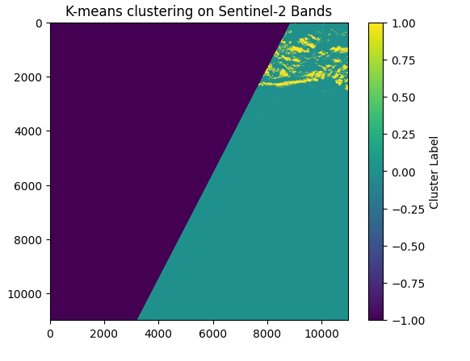

# Week 4 Assignment

## Overview
This project focuses on classifying echoes in leads and sea ice based on their shape and standard deviation.

## Steps
1. **Load Data**
2. **Data Processing**
   - Compute mean and standard deviation for leads and sea ice echoes.
   - Generate a confusion matrix.
3. **Visualization**
     
   *(Example of an echo classification result)*

## Installation
Run the following command to install dependencies:
```bash
pip install numpy pandas matplotlib scikit-learn
# 📌 Week 4 Assignment: Echo Classification

## 🔍 Overview
This project focuses on classifying echoes in **leads** and **sea ice** based on their shape and standard deviation.  
We use **Sentinel-3 altimeter data** and **Sentinel-2 optical data** for feature extraction and analysis.

---

## 📊 Data Processing Workflow
1️⃣ **Load Data**  
   - Import Sentinel-3 and Sentinel-2 datasets  
   - Preprocess raw echo signals  

2️⃣ **Feature Extraction**  
   - Compute **mean** and **standard deviation** of echoes  
   - Apply **unsupervised learning (K-means)** for classification  

3️⃣ **Model Evaluation**  
   - Compare predicted classifications with **ESA official labels**  
   - Use a **confusion matrix** to measure accuracy  

---

## 📌 Visualization
### **📌 K-Means Clustering on Sentinel-2 Bands**
> Example of classified echo data using **K-means clustering**:


🔹 **Color Meaning:**  
- 🟣 **Dark Purple:** Cluster 1 (Low Echo Intensity)  
- 🔵 **Teal:** Cluster 2 (Moderate Echo Intensity)  
- 🟡 **Yellow:** Cluster 3 (High Echo Intensity)

---

## 🚀 How to Run This Project

### ✅ **1. Install Dependencies**
```bash
pip install numpy pandas matplotlib scikit-learn
git clone https://github.com/khalil1026/week4assignment.git
cd week4assignment
jupyter notebook Chapter1_Unsupervised_Learning_Methods_Michel.ipynb
